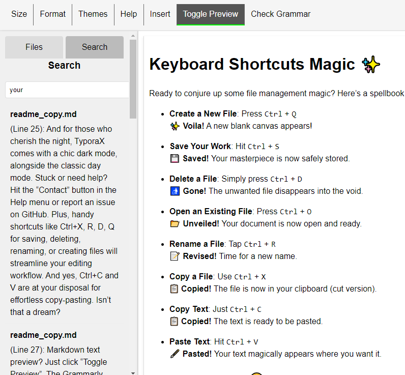

# TyporaX: The Magic of Markdown, Upgraded

## Why TyporaX?

Once upon a time, I was a devoted Typora user. Typora was my go-to for crafting simple lab notes, rich with images and ideas. Its seamless interface made writing a breeze. However, there was always a small wish—a desire for a Grammarly-like feature to polish my English. And thus, TyporaX was born.

Imagine a Typora experience, but with a twist. I’ve woven a Typora-like sidebar into the mix, letting you browse files with ease, searching by the keywords you type. And because I believe in inclusivity, I’ve added support for Uyghur and Chinese languages right in the editor. 🌟

Dropping images directly into the markdown editor? Absolutely. And for my grammar-savvy side, I’ve integrated the ChatGPT API. Now, you can ask for grammar checks, text summaries, and markdown formatting as much as you want. You can even tweak the editor’s settings for various file types. Just look at this:

Need to resize an image? Just adjust the width percentage:

Or center it with a simple tweak:

And for those who cherish the night, TyporaX comes with a chic dark mode, alongside the classic day mode. Stuck or need help? Hit the “Contact” button in the Help menu or report an issue on GitHub. Plus, handy shortcuts like Ctrl+X, R, D, Q for saving, deleting, renaming, or creating files will streamline your editing workflow. And yes, Ctrl+C and V are at your disposal for effortless copy-pasting. Isn’t that a dream?

Markdown text preview? Just click “Toggle Preview”. The Grammarly check should make your heart sing with joy. I hope TyporaX becomes your favorite tool for jotting down notes, writing diaries, and capturing memories. I’ll be diving into TyporaX myself, dreaming up new features as I go. The adventure is just beginning!

## How to Use This App

1. Clone the repository: `git clone https://github.com/Yusuprozimemet/TyporaX.git`
2. Install dependencies: `pip install setup.py`
3. Add your GPT API key to `config.yaml`. Without the key, ChatGPT features won’t work, but other functions will be available.
4. Open your terminal, navigate to `TyporaX/src`, and run: `python app.py`
5. Open Google Chrome or another browser. TyporaX will be available at [http://127.0.0.1:5000/](http://127.0.0.1:5000/)

---

## بۇ ئەپنى قانداق ئىشلىتىشكە كەلسەك ، بۇ يەردە ئاددىي بىر چۈشەندۈرۈش بار:

1. Ambarni klonlash: `git clone https://github.com/Yusuprozimemet/TyporaX.git`
2. Tayinishchanliqini ornitish: `pip install setup.py`
3. GPT API Achquchini `config.yaml` gha qoshung. Achquch bolmisa, ChatGPT iqtidari ishlemeydu, emma bashqa iqtidarliri bar.
4. Terminalingizni échish, "TyporaX/src" gha yötkeng we ijra qiling: `python app.py`
5. Google Chrome yaki bashqa torkörgüchni échish. TyporaX ni [http://127.0.0.1:5000/](http://127.0.0.1:5000/) din tapqili bolidu.
---

## 关于如何使用此应用程序，这里有一个简单的说明：

1. 克隆仓库：`git clone https://github.com/Yusuprozimemet/TyporaX.git`
2. 安装依赖：`pip install setup.py`
3. 将您的 GPT API 密钥添加到 `config.yaml`。不添加密钥，您将无法使用 ChatGPT，但其他功能仍可用。
4. 打开终端，进入 `TyporaX/src` 目录，然后运行：`python app.py`
5. 打开 Google Chrome 或其他浏览器。TyporaX 将在 [http://127.0.0.1:5000/](http://127.0.0.1:5000/) 上运行。
