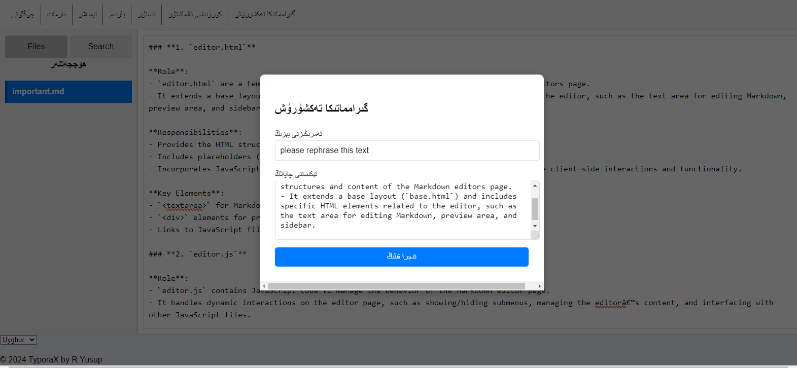
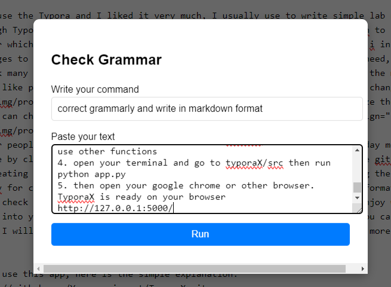
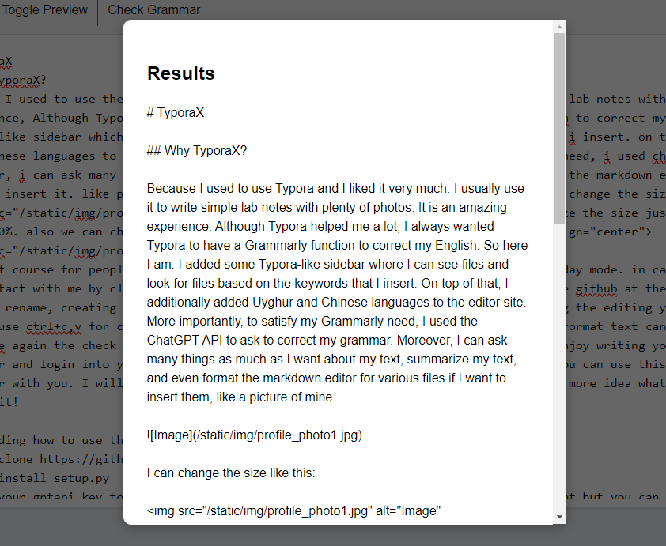

# TyporaX

## Why TyporaX?

Because I used to use Typora and I liked it very much. I usually use it to write simple lab notes with plenty of photos. It is an amazing experience. Although Typora helped me a lot, I always wanted Typora to have a Grammarly function to correct my English. So here I am. I added some Typora-like sidebar where I can see files and look for files based on the keywords that I insert. On top of that, I additionally added Uyghur and Chinese languages to the editor site.

 

you can drop down the image on the markdown editor!!! More importantly, to satisfy my Grammarly need, I used the ChatGPT API to ask to correct my grammar. Moreover, I can ask many things as much as I want about my text, summarize my text, and even format the markdown editor for various files if I want to insert them.

I can change the size like this:

I can customize the size by simply changing the percentage width:10%. Also, we can change the position of the picture in the center like this:

Of course, for people who enjoy dark mode, I introduced the dark mode alongside the day mode. In case you have questions or require assistance, you can contact me by clicking "Contact" inside the Help menu. You can also submit an issue to the GitHub. At the same time, I made a shortcut to save, delete, rename, and create a new file with Ctrl+X, R, D, Q, which definitely saves time during editing your file. Since this is a web app, you can freely use Ctrl+C, V for copy-pasting text. Isn't that really nice? No worries. Markdown format text can be previewed by clicking "Toggle Preview". Of course, the Grammarly check makes you happiest, I guess. I hope you will enjoy writing your text. Last but not least, you should register and log in to your account, which slightly keeps your privacy. That means you can use this for writing your diary and keeping your memories together with you. I will also use TyporaX more in the future, which may give me more ideas on what features I should add to this app. That's it!

## Regarding how to use this app, here is a simple explanation:
1. git clone https://github.com/Yusuprozimemet/TyporaX.git
2. pip install setup.py
3. Add your GPT API key to the config.yaml. Without adding your key, you cannot use ChatGPT, but you can use other functions.
4. Open your terminal and go to TyporaX/src, then run python app.py.
5. Then open your Google Chrome or another browser. TyporaX is ready on your browser at http://127.0.0.1:5000/
